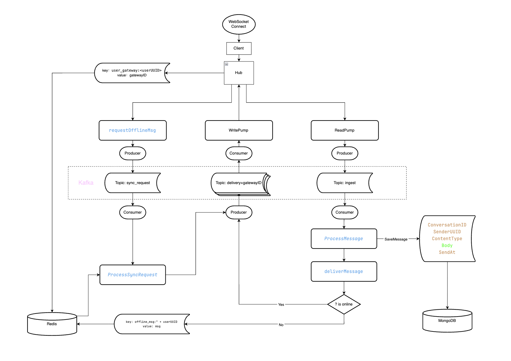

# MyGoChat

一个基于 Go 语言的分布式即时通讯系统，采用 Gateway + Logic 分离架构。

## 功能特性

- 用户注册与登录（JWT 认证）
- 好友关系管理
- 私聊消息（实时 + 离线同步）
- 群聊消息
- WebSocket 实时通信
- 消息持久化存储

## 技术栈

| 组件 | 技术 | 说明 |
|------|------|------|
| Web 框架 | Gin | HTTP 路由、中间件 |
| ORM | GORM | PostgreSQL 操作 |
| 关系型数据库 | PostgreSQL | 用户、群组、关系数据 |
| 文档数据库 | MongoDB | 消息、会话存储 |
| 缓存/路由 | Redis | 用户在线状态、离线消息队列 |
| 消息队列 | Kafka | 消息投递、异步处理 |
| 序列化 | Protobuf | 消息格式定义 |
| 实时通信 | WebSocket | 消息推送 |
| 容器化 | Docker | 服务部署 |

## 系统架构

**会话流程：**
1. Client 通过 WebSocket 连接 Gateway
2. Gateway 将消息发送到 Kafka Ingest Topic
3. Logic 消费消息，处理业务逻辑（存储、路由计算）
4. Logic 查询 Redis 确定用户在线状态
5. 在线用户：投递到 Kafka Delivery Topic → Gateway 推送
6. 离线用户：存入 Redis 离线队列，上线时同步



## 项目结构

```
MyGoChat/
├── api/v1/                  # Protobuf 消息定义
├── cmd/
│   ├── gateway/             # Gateway 服务入口
│   └── logic/               # Logic 服务入口
├── configs/                 # 配置文件
├── deployments/             # Docker 部署配置
├── internal/
│   ├── chat/                # 聊天模块 (消息、会话)
│   ├── gateway/             # Gateway 模块 (WebSocket)
│   ├── group/               # 群组模块
│   ├── middleware/          # 中间件 (CORS, JWT)
│   ├── platform/            # 平台层 (数据库连接)
│   ├── relation/            # 关系模块 (好友、群成员)
│   ├── server/              # HTTP 路由
│   ├── user/                # 用户模块
│   └── util/                # 工具函数
├── pkg/
│   ├── common/              # 请求/响应结构体
│   ├── config/              # 配置加载
│   ├── HTML/                # 前端测试页面
│   ├── kafka/               # Kafka 生产者/消费者
│   ├── log/                 # 日志
│   ├── redis/               # Redis 客户端
│   ├── test/                # 测试用例
│   └── token/               # JWT 工具
└── Markdown/                # 项目文档
```

## 快速开始

### 环境要求

- Go 1.18+
- PostgreSQL 12+
- MongoDB 4.4+
- Redis 6+
- Kafka 2.8+
- Docker (可选)

### 安装与启动

```bash
# 克隆仓库
git clone https://github.com/RichardoKang/MyGoChat.git
cd MyGoChat

# 安装依赖
go mod tidy

# 启动依赖服务 (可选，使用 Docker)
docker-compose -f deployments/docker-compose.yaml up -d

# 启动 Logic 服务 (端口 8080)
go run ./cmd/logic/main.go

# 启动 Gateway 服务 (端口 8081)
go run ./cmd/gateway/main.go
```

或使用启动脚本：

```bash
./start.sh
```

## API 接口

### 用户模块

| 方法 | 路径 | 说明 |
|------|------|------|
| POST | /api/user/register | 用户注册 |
| POST | /api/user/login | 用户登录 |
| PUT | /api/user/info/update | 更新用户信息 |

### 消息模块

| 方法 | 路径 | 说明 |
|------|------|------|
| POST | /api/message/send | 发送消息 |
| GET | /api/message/history/:conversationId | 获取历史消息 |
| GET | /api/message/conversations | 获取会话列表 |
| POST | /api/message/conversation/private | 创建私聊会话 |
| POST | /api/message/sync-offline | 同步离线消息 |

### 关系模块

| 方法 | 路径 | 说明 |
|------|------|------|
| POST | /api/relations/add-friend | 添加好友 |
| POST | /api/relations/add-group | 加入群组 |
| GET | /api/relations/list | 获取关系列表 |

### 群组模块

| 方法 | 路径 | 说明 |
|------|------|------|
| POST | /api/group/create | 创建群组 |

### WebSocket

| 路径 | 说明 |
|------|------|
| ws://localhost:8081/ws?token={jwt} | WebSocket 连接 |

## 前端测试页面

项目提供 HTML 测试页面用于开发调试：

**文件**: `pkg/HTML/index.html`

**使用方法**:
```bash
# 启动服务后，在浏览器中打开
open pkg/HTML/index.html
```

**功能**:
- 用户登录/注册
- WebSocket 连接管理
- 会话列表展示
- 实时消息收发
- 好友添加
- 调试日志输出

**测试流程**:
1. 注册/登录用户
2. 添加好友
3. 连接 WebSocket
4. 选择会话并发送消息

## 配置说明

配置文件位于 `configs/` 目录：

```yaml
# config.dev.yaml
postgresql:
  host: 127.0.0.1
  port: 5432
  user: postgres
  password: your_password
  dbname: mygochat

mongo:
  uri: mongodb://localhost:27017
  database: mygochat

redis:
  addr: 127.0.0.1:6379
  password: ""
  db: 0

kafka:
  brokers:
    - localhost:9092
  topics:
    ingest: im_message_ingest
    delivery: im_message_delivery_
    sync_request: im_sync_request

jwt:
  secret: your_jwt_secret
  expire: 24h

log:
  path: ./logs
  level: debug
```

## 注意事项

1. **端口配置**: Logic 服务运行在 8080，Gateway 服务运行在 8081
2. **JWT Token**: WebSocket 连接需要携带有效的 JWT Token
3. **消息顺序**: 同一会话的消息通过 Kafka 分区键保证顺序
4. **离线消息**: 用户上线时自动同步离线消息

## License

MIT License
